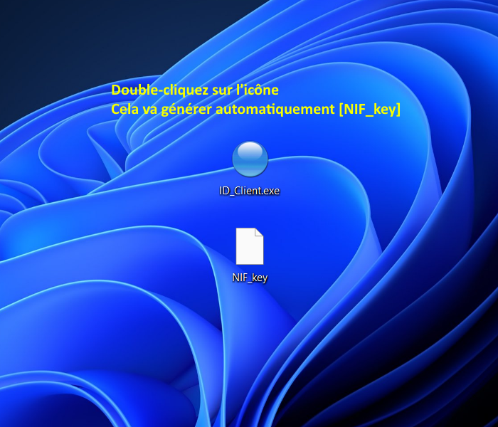
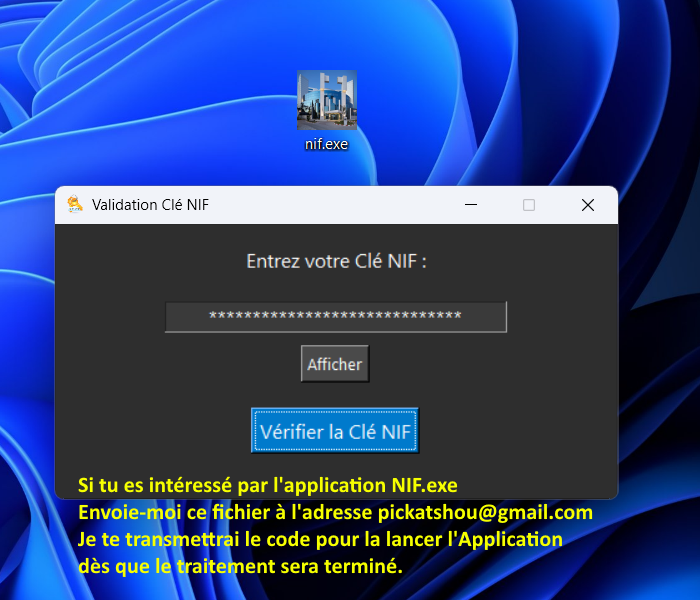
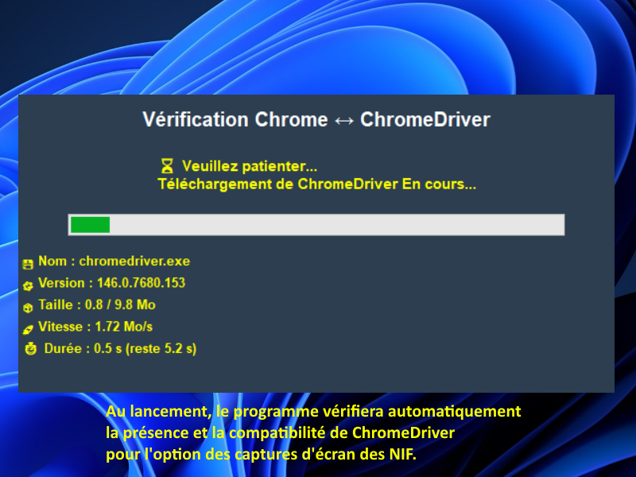

# 🔍 NIF Search Tool - Application de Recherche NIF

Bienvenue sur le hub officiel de l'application **NIF.exe**. Cet outil permet la recherche et la gestion des numéros d'identification fiscale (NIF) avec option de capture d'écran automatisée.

---
### 🔑 Étapes pour l'activation :
Pour utiliser l'application, suivez ces étapes :
1. Téléchargez et lancez **ID_Client.exe**.
2. Ce programme va générer un fichier d'identification unique sur votre bureau. 
3. Envoyez ce fichier par e-mail à : **pickatshou@gmail.com**
4. Une fois votre code reçu, vous pourrez lancer l'application principale **NIF.exe**. 

> **Note :** Le délai de réponse peut varier selon la charge du système.

---

## 📅 Période d'Essai
L'application est actuellement disponible en **version d'essai gratuite** jusqu'au **18/05/2026**.

---

## ⚙️ Prérequis Techniques
* **Navigateur :** Google Chrome (doit être à jour). 
* **ChromeDriver :** Au lancement, le programme vérifiera automatiquement la présence et la compatibilité de `chromedriver.exe`. Cette étape est indispensable pour la fonction **Capture d'écran**.
* **Prudence :** Utilisez le code et l'application avec précaution !!!

---

## 🛡️ Clause de Non-Responsabilité (Légal)
**L'utilisateur est le SEUL ET UNIQUE RESPONSABLE de l'usage qu'il fait de cette application.** 

L’auteur décline toute responsabilité, présente ou future, vis-à-vis de la loi, des administrations fiscales ou de tout tiers. Ce logiciel est fourni "en l'état". En aucun cas l’auteur ne pourra être tenu responsable de toute réclamation, poursuite, dommage ou autre responsabilité (contractuelle ou délictuelle) découlant de l'utilisation du logiciel. **L'utilisateur renonce expressément à tout recours judiciaire contre l'auteur.**

---

## 🔒 Protection et Intégrité
Toute tentative d'altération, de modification, de décompilation ou de **débogage (debugging)** est strictement interdite. 
L'utilisateur assume seul la responsabilité des mesures de protection automatique que l'application pourrait déclencher pour préserver son intégrité en cas de détection de telles activités.

---
*Développé pour simplifier vos recherches fiscales avec transparence et efficacité.*
